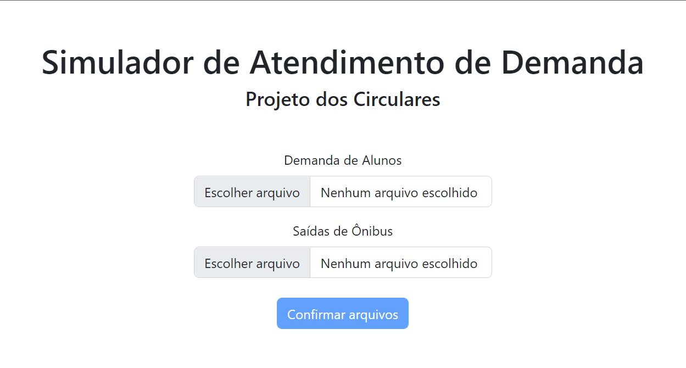

# Guia de utilização do Simulador de Circulares

Esse guia apresenta o passo-a-passo para se utilizar o simulador de circulares para obter a porcentagem de atendimento do serviço prevista através de demandas, partidas de ônibus e rotas.

## Pré-requisitos

Garanta que o sistema está rodando a partir do _Setup_ presente no README deste repositório.

## Passo 1

Acesse o sistema em [http://localhost:3001](http://localhost:3001). (O sistema pode estar em outra url, caso uma alternativa tenha sido utilizada na execução do sistema)

## Passo 2

Carregue os arquivos de demanda e de número de partidas, respectivamente, nos dois campos "Escolher Arquivos" como na imagem. 

Os templates de ambos os arquivos estão presentes neste repositório e devem ser seguidos à risca (apenas os valores numéricos da demanda e das partidas devem ser alterados).

Ao fazer isso, pressione "Confirmar Arquivos" para continuar.

## Passo 3

Selecione os pontos de ônibus pertencentes a cada uma das 5 rotas disponíveis. Essas rotas são:
 - Linha 8012 (Sentido Butantã -> P3)
 - Linha 8012 (Sentido P3 -> Butantã)
 - Linha 8022 (Sentido Butantã -> P3)
 - Linha 8022 (Sentido P3 -> Butantã)
 - Linha 8032 (Circular)

Para selecioná-los basta marcar as respectivas opções e "Confirmar".

## Passo 4

Pressione "Simular resultados" para executar a simulação e receber os resultados de porcentagem de sucessos por ponto de ônibus.